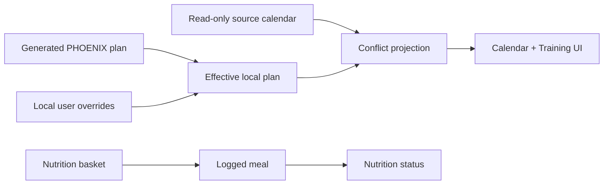

# PHOENIX User Control Upgrade Design

## Goal

Turn PHOENIX from a mostly read-only cockpit into a daily control surface for the user's own plan. The upgrade adds local, user-owned planning and editing layers while preserving all external safety boundaries:

- Plaan, Google Calendar, Gmail, broker, and market-data integrations remain read-only.
- PHOENIX may create, edit, delete, and audit only its own local records.
- No training, nutrition, finance, or calendar action is automatic unless the user explicitly confirms it.

The work ships as three vertical slices:

1. Training Calendar Planner
2. Meal Builder Basket
3. Training Plan Editor

## Current Findings

The app is technically healthy: frontend tests and build pass, and the full backend test suite passes. The main gaps are product-control gaps:

- Calendar shows source schedule state, but cannot place local PHOENIX training sessions into the week.
- Nutrition can log recipes, staples, recent items, barcode lookups, and custom macro rows, but it cannot build an editable meal from individual foods before saving.
- Training can use readiness to tune today's route, but it cannot edit the workout, move sessions, or persist user plan changes.

## Design Principles

- **Local planning layer:** PHOENIX owns local planning records. It never writes to Plaan or Google Calendar.
- **Approval first:** Proposed changes are previews until the user saves or confirms them.
- **Auditability:** Plan changes should record what changed, when, and why.
- **Existing patterns first:** Use existing FastAPI routers, SQLite persistence helpers, `pwa/src/api/client.js`, and current dashboard route structure.
- **No fake certainty:** Conflict warnings and nutrition/training recommendations should state their source and fallback behavior.

## Slice 1: Training Calendar Planner

### User Experience

Calendar gains a PHOENIX training layer alongside the existing read-only source schedule. The user can see planned training blocks on the week view, inspect conflicts with opera/work events, and move a training block to another day or time.

Primary actions:

- Show planned training sessions for the selected week.
- Add a local training block from the current generated plan.
- Move a training block to another day/time.
- Mark a block as skipped, completed, or recovery-only.
- Show conflict warnings when a block is on or near a performance/rehearsal day.

### Backend

Add local calendar-planning endpoints in the training router first, using a small training/calendar service module if the router boundary becomes too large:

- `GET /training/calendar-plan?start_date=YYYY-MM-DD&days=7`
- `POST /training/calendar-plan/blocks`
- `PATCH /training/calendar-plan/blocks/{block_id}`
- `DELETE /training/calendar-plan/blocks/{block_id}`
- `GET /training/calendar-plan/conflicts?start_date=YYYY-MM-DD&days=7`

Local block fields:

- `block_id`
- `date`
- `time_start`
- `time_end`
- `session_type`
- `source`
- `status`
- `title`
- `notes`
- `created_at`
- `updated_at`

Statuses:

- `planned`
- `moved`
- `completed`
- `skipped`
- `recovery_only`

### Frontend

Calendar keeps its read-only source labeling, but adds a visible PHOENIX layer:

- Week map shows source events and local training blocks.
- Event detail can answer "how does this affect training?"
- Training blocks have edit/move actions.
- Conflict cards explain the reason and suggested safer windows.

Training dashboard links into the same planner so "today's session" and "week plan" agree.

### Error Handling

- If source calendar is unavailable, local training blocks still render with a "source schedule unavailable" warning.
- If a move would create a hard conflict, the UI allows save only after an explicit confirmation.
- If generated training plan is unavailable, the calendar planner can still create a manual local block.

### Tests

- Backend tests for local block CRUD and conflict projection.
- Calendar UI contract tests for source read-only labels plus local editable PHOENIX blocks.
- Training/calendar integration tests verifying moved sessions affect the displayed training plan.

## Slice 2: Meal Builder Basket

### User Experience

Nutrition gains an editable basket before logging. The user can add individual foods from recipes, staples, recent meals, barcode lookup, or custom macros; adjust servings; remove items; name the meal; then save it.

Primary actions:

- Add one or more foods to a basket.
- Edit servings and macros for custom items.
- See live meal totals.
- Save basket as a logged meal.

### Backend

The current single-row meal log remains valid. Add a new composed meal path without breaking existing logs:

- `POST /nutrition/meal-basket/preview`
- `POST /nutrition/log/composed-meal`

Reusable saved meals are out of scope for this spec. They require a separate design before implementation.

Composed meal fields:

- `meal_name`
- `slot`
- `items`
- `total`
- `source`
- `created_at`

Basket item fields:

- `item_id`
- `item_type`
- `name`
- `servings`
- `unit`
- `calories`
- `protein_g`
- `carbs_g`
- `fat_g`
- optional `price_eur`

The existing `log_meal` table can initially store composed meals as one summarized row with `source="composed_meal"` and preserve the item list in a JSON metadata field if available. If the current database helper lacks metadata storage, add a companion `nutrition_meal_items` table.

### Frontend

`LogMeal` becomes a two-pane flow:

- Left: search/select foods.
- Right: current basket with totals and save action.

Existing recipe/staple/recent/custom tabs stay, but clicking a food adds it to the basket instead of immediately treating it as the whole meal. A quick "log single item" affordance can remain for speed.

### Error Handling

- Empty basket cannot be saved.
- Macros must be finite and non-negative.
- User-created custom items require a name and calories.
- If barcode lookup lacks reliable macros, the item can be added only after user correction.

### Tests

- Model tests for basket totals and rounding.
- Backend tests for composed meal logging and daily macro aggregation.
- UI contract tests that custom food no longer means only "save custom meal"; it can add to a basket.

## Slice 3: Training Plan Editor

### User Experience

Training gains editable local overrides. The generated program remains the source of truth, but the user can adjust local execution:

- Swap or remove an exercise for a session.
- Change sets, reps, load, or notes.
- Change a session type for a specific day.
- Convert a session to recovery-only.
- Move a session through the calendar planner.
- See an audit note explaining each override.

### Backend

Add local override storage:

- `GET /training/plan-overrides?start_date=YYYY-MM-DD&days=7`
- `POST /training/plan-overrides`
- `PATCH /training/plan-overrides/{override_id}`
- `DELETE /training/plan-overrides/{override_id}`

Override fields:

- `override_id`
- `date`
- `target`
- `operation`
- `payload`
- `reason`
- `created_at`
- `updated_at`

Targets:

- `session`
- `exercise`
- `load`
- `capacity_block`

Operations:

- `replace`
- `remove`
- `adjust`
- `recovery_only`
- `note`

Training status and routed-session responses should merge generated plan plus active overrides, and expose both:

- `generated_plan`
- `active_overrides`
- `effective_plan`

### Frontend

Training dashboard adds clear edit affordances:

- "Edit today"
- "Move in calendar"
- "Swap exercise"
- "Adjust load"
- "Recovery only"

Active session should show whether a field is generated or locally overridden. The user can reset a single override or all overrides for a day.

### Error Handling

- Invalid override payloads are rejected before persistence.
- Overrides cannot remove required safety/readiness checks.
- Recovery-only overrides cannot be accidentally converted back to high-neural work without a new readiness confirmation.

### Tests

- Backend tests for override merge behavior.
- Safety tests proving readiness gates still win over user overrides.
- UI contract tests for edit/reset affordances and generated-vs-overridden labels.

## Shared Data Flow

## Rollout Plan

Implement one slice at a time:

1. Training Calendar Planner
2. Meal Builder Basket
3. Training Plan Editor

Each slice should ship with backend contract tests, frontend model/UI contract tests, and a manual browser smoke pass.

## Non-Goals

- No Plaan writes.
- No Google Calendar event creation or mutation.
- No broker execution.
- No automatic food logging from planner output.
- No AI-generated workout changes without explicit user approval.
- No broad visual redesign unless required by the workflow.

## Acceptance Criteria

The upgrade is complete when:

- The user can see and move PHOENIX training blocks inside calendar without modifying external calendars.
- The user can build a meal from individual foods and log it as one meal.
- The user can edit the effective training session while preserving safety gates and an audit trail.
- All existing tests pass.
- New tests cover planner blocks, composed meals, and training overrides.
- Browser smoke confirms the three workflows are reachable from the app UI.
